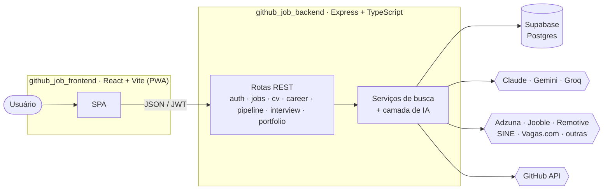

<div align="center">

# 🧭 GitHub Job Finder

### Encontre vagas compatíveis com o seu perfil real — GitHub, LinkedIn e histórico profissional — e gere o currículo certo para cada uma.

Plataforma full-stack que lê o que você **já construiu** (repositórios, stack, experiência),
cruza com vagas de múltiplas fontes, rankeia com IA e monta um currículo sob medida por vaga.

<br>


<br>

<a href="#-funcionalidades"><b>Funcionalidades</b></a> &nbsp;·&nbsp;
<a href="#-arquitetura"><b>Arquitetura</b></a> &nbsp;·&nbsp;
<a href="#-começando"><b>Começando</b></a> &nbsp;·&nbsp;
<a href="#-variáveis-de-ambiente"><b>Ambiente</b></a> &nbsp;·&nbsp;
<a href="#-estrutura-do-monorepo"><b>Estrutura</b></a>

</div>

---

## ✨ Visão geral

A maioria dos agregadores de vaga parte da _vaga_. Aqui o ponto de partida é o **candidato**:

1. **Importe o seu perfil** — conecte um usuário do GitHub, envie o PDF/ZIP do LinkedIn ou cole seu histórico em texto.
2. **A plataforma entende a sua stack** — linguagens, frameworks, projetos de destaque, senioridade e área de atuação.
3. **Busca multi-fonte** — vagas vêm de APIs estruturadas (Adzuna, Jooble, Remotive, SINE, entre outras) com _fallback_ para busca assistida por IA quando a fonte não cobre o filtro.
4. **Ranking e enriquecimento com IA** — cada vaga recebe _match score_, resumo, pontos fortes/lacunas do seu perfil e verificação básica do link.
5. **Currículo por vaga** — gere, edite e exporte (Markdown / PDF) um CV adaptado ao que aquela vaga pede, com estimativa de aderência a ATS.
6. **Acompanhe o processo** — histórico de buscas, vagas salvas/descartadas, painel Kanban de candidaturas, estúdio de entrevista e gerador de mensagens de abordagem.

---

## 🚀 Funcionalidades

<table>
<tr>
<td width="50%" valign="top">

### 🔎 Descoberta de vagas
- Busca por **perfil GitHub** (stack inferida dos repositórios)
- Busca por **histórico do LinkedIn** (PDF, ZIP ou texto)
- Busca por **profissão / cargo** livre
- **Análise de vaga por link** — cole a URL e receba o parecer
- Preferências: modalidade, localização, faixa salarial, nível e idade máxima da vaga
- Múltiplos provedores com _fallback_ inteligente

</td>
<td width="50%" valign="top">

### 🧠 Inteligência aplicada
- _Match score_ e enriquecimento vaga a vaga
- Resumo, pontos fortes e lacunas do perfil
- Verificação básica de links quebrados/expirados
- Provedores: **Claude**, **Gemini** e **Groq**
- _Query builder_ e inferência de categoria/senioridade

</td>
</tr>
<tr>
<td width="50%" valign="top">

### 📄 Currículo & portfólio
- Geração de CV **por vaga** em Markdown
- Editor com pré-visualização e exportação **PDF**
- Versionamento de currículos
- Estimativa de aderência a **ATS**
- Biblioteca de projetos e **portfólio público** (`/public/:username`)

</td>
<td width="50%" valign="top">

### 🗂️ Acompanhamento
- Histórico de buscas e da última _query_
- Vagas salvas, marcadas como vistas e descartadas
- **Kanban** de candidaturas (drag & drop)
- **Estúdio de entrevista** com simulação e insights
- Gerador de **mensagens de abordagem**
- Tendências de mercado

</td>
</tr>
</table>

> 🔐 Autenticação por e-mail/senha com **JWT**. Sessão persistida no cliente. Dados no **Supabase (Postgres)**.
> 📱 O frontend é uma **PWA instalável**.

---

## 🏗️ Arquitetura



Dois repositórios independentes, unidos aqui como **submódulos git**:

| Componente | Repositório | Stack |
|---|---|---|
| **Frontend** | [`luc118i/github_job_frontend`](https://github.com/luc118i/github_job_frontend) | React 18 · Vite 5 · TypeScript · React-PDF · React-Markdown · dnd-kit · vite-plugin-pwa |
| **Backend** | [`luc118i/github_job_backend`](https://github.com/luc118i/github_job_backend) | Node 20 · Express 4 · TypeScript · Supabase · Multer · pdf-parse · SDKs Anthropic/Google/Groq |

---

## 📦 Estrutura do monorepo

```text
Github-job-finder/
├── frontend/                → submódulo → github_job_frontend
├── backend/                 → submódulo → github_job_backend
├── github-job-finder.jsx    → protótipo single-file (histórico)
├── .gitmodules
└── README.md
```

Este repositório guarda a **composição** do produto: qual commit do frontend casa com qual
commit do backend em cada ponto do tempo. O código de cada lado vive no seu próprio repositório.

---

## 🛠️ Começando

### 1. Clonar com submódulos

```bash
git clone --recursive https://github.com/luc118i/Github-job-finder.git
cd Github-job-finder
```

Já clonou sem `--recursive`?

```bash
git submodule update --init --recursive
```

### 2. Backend

```bash
cd backend
npm install
cp .env.example .env      # preencha as chaves — veja a seção abaixo
npm run dev               # sobe em http://localhost:3001  (health: GET /health)
```

### 3. Frontend

```bash
cd frontend
npm install
# opcional: echo "VITE_API_URL=http://localhost:3001" > .env.local
npm run dev               # sobe em http://localhost:5173
```

O frontend precisa do backend rodando em `http://localhost:3001` (ou no valor de `VITE_API_URL`).

### Atualizar os submódulos para o último commit de cada lado

```bash
git submodule update --remote --merge
git add frontend backend && git commit -m "chore: bump submódulos"
```

---

## 🔑 Variáveis de ambiente

### Backend — `backend/.env`

| Variável | Obrigatória | Função |
|---|:---:|---|
| `ANTHROPIC_API_KEY` | ✅ | Fluxos de busca com IA e geração de CV (Claude) |
| `GOOGLE_API_KEY` | ✅ | Alternativa/complemento de IA (Gemini) |
| `SUPABASE_URL` | ✅ | Projeto Supabase |
| `SUPABASE_SERVICE_ROLE_KEY` | ✅ | Acesso ao banco — **somente no backend**, nunca no cliente |
| `JWT_SECRET` | ✅ | Assinatura dos tokens de sessão |
| `ADZUNA_APP_ID` / `ADZUNA_APP_KEY` | ⬜ | Busca estruturada via Adzuna (com _fallback_ para IA) |
| `PORT` | ⬜ | Porta da API (padrão `3001`) |
| `FRONTEND_URL` | ⬜ | Origem permitida no CORS (padrão `http://localhost:5173`) |

### Frontend — `frontend/.env.local`

| Variável | Obrigatória | Função |
|---|:---:|---|
| `VITE_API_URL` | ⬜ | URL da API (padrão `http://localhost:3001`) |

> Detalhes completos nos READMEs de cada submódulo:
> [frontend](https://github.com/luc118i/github_job_frontend#readme) ·
> [backend](https://github.com/luc118i/github_job_backend#readme).

---

## 🧱 Principais grupos de rotas (backend)

| Prefixo | Responsabilidade |
|---|---|
| `/auth` | Registro, login, `me` |
| `/jobs` · `/professionJobs` | Busca de vagas por perfil e por cargo |
| `/analyzeLink` | Parecer sobre uma vaga a partir da URL |
| `/linkedin` | Importação de PDF/ZIP/texto do LinkedIn |
| `/searches` | Histórico e última _query_ |
| `/cv` | Geração, versões, adaptação e exportação de currículo |
| `/career` | Perfil de carreira, preferências, chat de refinamento |
| `/pipeline` | Kanban de candidaturas e insights |
| `/interview` | Estúdio de entrevista (simulação) |
| `/messages` | Mensagens de abordagem |
| `/portfolio` · `/projects` | Portfólio público e biblioteca de projetos |

---

## 🗺️ Roadmap

- [ ] Screenshots e GIF de demonstração neste README (`docs/screenshots/`)
- [ ] Deploy público de referência
- [ ] Definição de licença

---

## 👤 Autor

Desenvolvido por [**@luc118i**](https://github.com/luc118i).

> Projeto de uso privado — ainda **sem licença pública definida**. Todos os direitos reservados ao autor.
